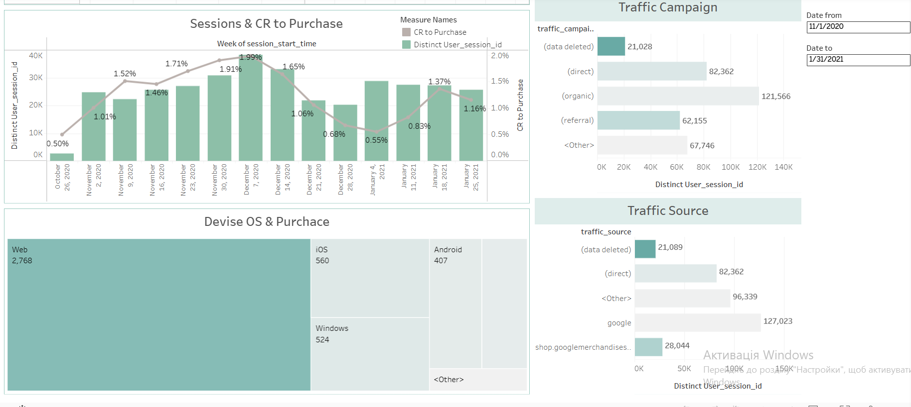
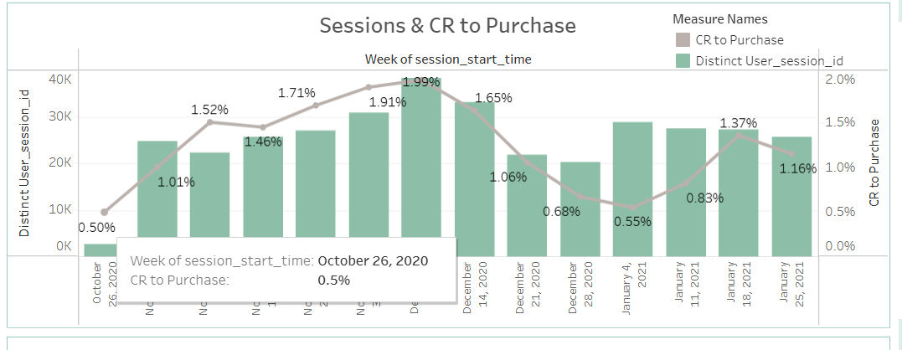

# 📊 E-commerce Conversion Funnel & Marketing Analytics Dashboard

## 📌 Project Overview
This project was developed for a marketing department to analyze sales funnel efficiency, user behavior, and traffic source performance. The data is extracted from the public **Google Analytics 4 (GA4) obfuscated e-commerce dataset** hosted on **Google BigQuery**. 

The final dashboard provides marketing managers with actionable insights into traffic quality, drop-off points, and behavioral segments.

**🔗 [Link to the Interactive Dashboard on Tableau Public](https://public.tableau.com/views/ProjectEcomerceFunnel/EcomerceFunnel?:language=en-US&publish=yes&:sid=&:redirect=auth&:display_count=n&:origin=viz_share_link)**

## 🛠️ Tech Stack & Skills Demonstrated
- **SQL (Google BigQuery)**: Writing optimized queries, unnesting complex nested structures (`UNNEST` on `REPEATED RECORD`), creating composite unique keys, and cleaning URLs via regular expressions (`REGEXP_EXTRACT`).
- **Tableau Desktop**: Building an interactive end-to-end dashboard, designing dual-axis visualization trends, calculating custom advanced business metrics (`CR to Purchase`), and filtering high-cardinality dimensions using `FIXED LOD` expressions alongside parameters.

## 📐 Analyzed Funnel Milestones
The dashboard tracks user progression across the following 7 critical stages of the e-commerce journey:
1. **Session Start** (`session_start`) — Initial user visit
2. **View Item** (`view_item`) — Product page engagement
3. **Add to Cart** (`add_to_cart`) — Shopping cart intent
4. **Begin Checkout** (`begin_checkout`) — Initiation of the purchase flow
5. **Add Shipping Info** (`add_shipping_info`) — Shipping details provided
6. **Add Payment Info** (`add_payment_info`) — Payment details provided
7. **Purchase** (`purchase`) — Successful order placement

## 📈 Key Visualizations & Features
- **Conversion Funnel Chart**: Maps out sequential user drop-offs to pinpoint exactly where friction occurs in the checkout process.
- **Sessions & Conversion Trend (Dual-Axis Chart)**: A combined visualization where the green bars represent traffic volume (`Distinct User Sessions`) on the left axis, and the gray line tracks the conversion quality (`CR to Purchase`) over time on the right axis.
- **Interactive Segmentation**: Equipped with global dashboard actions, enabling users to click any device category or operating system to instantly re-filter the entire funnel.

- ## 🔍 Key Data Insights (Based on Dashboard Trends)
- **Conversion Rate Peak**: The store reached its highest conversion efficiency (**1.99% CR**) during the week of **December 7, 2020**, which perfectly correlated with the highest traffic volume of the quarter (~40K sessions). This indicates highly successful marketing campaigns and strong seasonal demand.
- **Post-Holiday Slump**: A sharp drop in conversion rate was observed starting from **late December (0.68% CR)** through **early January (0.55% CR)**. While traffic volume remained relatively stable (~30K sessions), purchasing intent decreased significantly, which is a common post-holiday retail trend.
- **Funnel Bottleneck**: The largest user drop-off occurs right after the **Product View (`view_item`)** stage. Optimizing the product page UX and implementing retargeting campaigns for cart abandoners represent the highest growth opportunities for the marketing team.

## 📸 Dashboard Preview

